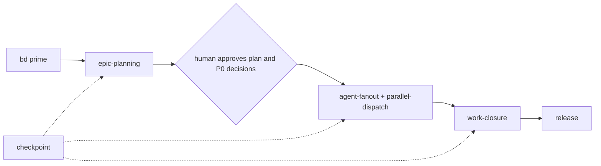

# Agent instructions

These vendor-neutral [AGENTS.md](https://agents.md) standards apply to every agent and human in this repository.
Personal tool preferences belong in each developer's dotfiles.

## Issue tracking

This project uses **bd (beads)** for issue tracking. It is mandatory.

- Run `bd prime` for workflow context.
- `bd ready` finds unblocked work. `bd update <id> --claim` claims it atomically.
- `bd create "<title>" --type task --priority <0-4>` files any work over 2 minutes.
- `bd close <id>` when done.
- Never track work in markdown TODO lists; file a bead.
- Record durable facts and cross-task decisions with `bd remember "<fact>" --key <slug>`, never in MEMORY.md or NOTES.md.
- Put task-local choices in that bead's notes.
- On a long task, run `bd set-state <id> phase=<value> --reason "<what happened>"` at each phase boundary.
- Write a `bd note` handoff before any risky step.
- To resume work, read `bd show <id>` and `bd state list <id>`, then check `git status` and `git log`; the tree wins.

### The work chain



Skills install per machine from dotfiles; a project carrying `.agents/skills/` has drifted, so move them out.
One agent is the default; skip stages only for one small bead, and never skip the human gate.
The chain lives in committed text and names capability tiers, never vendors or models.

## Research before code

Look up any unverified third-party API, library, CLI or platform behavior before coding against it, and cite the source.
Never rely on training data, especially in tests: a test encoding an assumption is worse than none.

For "solve problem X", also research X's next-order need, such as propagation or drift, before finalizing a design.
Name the established tool category, and check whether a more complete tool covers that need.

## Test-driven development, where plausible

Write the failing test before the implementation for new features and bug fixes.
Exceptions are docs, logic-free config, generated or vendored files, and initial scaffolding.
For other exceptions, add a `No-Test-Needed: <reason>` trailer to the commit message.

## Commit messages and traceability

See `docs/conventional-commits.md` for the full spec.
Every commit header follows [Conventional Commits](https://www.conventionalcommits.org/).
Every commit needs a `Refs: <bead-id-or-issue>` trailer, with no exceptions.
`lefthook.yml` enforces both after `lefthook install`; CI repeats them because `--no-verify` bypasses hooks.

## Definition of done, and shipping

Work is done when every line below holds. Not done means not releasable.

1. The bead's `ACCEPTANCE_CMD` exits 0. Close it with the `bd-close-verified.sh` script from the `epic-planning` skill, never plain `bd close`.
2. `bash scripts/pre-commit-checks.sh all` exits 0 on a clean checkout of the merged tree; CI runs exactly this.
3. The change is on `main` through a merged PR; every commit carries a `Refs:` trailer.
4. No open P0 or P1 bead names the change.

An epic's last child is a release bead. The epic closes with it, and it closes when the tag is on the remote.
The release commit also goes through a branch and a PR, because `main` is branch-protected:

```bash
git switch -c release/<version>
git cliff --bumped-version                        # chore/ci/docs/style/test/build never bump (cliff.toml [bump])
git cliff --bump -o CHANGELOG.md
git add CHANGELOG.md                              # explicit: never sweep unrelated edits in
git commit -m "chore(release): <version>" -m "Refs: <release-bead>"
# open the PR, merge it, then tag that exact merge commit:
git switch main && git pull --ff-only
git tag -a <version> <merge-sha> -m "<version>" && git push origin <version>
```

Before tagging, create the release bead and run a security review on `git diff <last-tag>..HEAD`.
Use the `security-reviewer` subagent, `security_scan` with `target_kind=ref_diff`, or your team's scanner.
Record it as a bead labeled `security-review`, then run `bd dep add <release-bead> <security-review-bead>`.
The first release gets a full-repo baseline; later releases review only the diff. Note the scope in the review bead.
`gitleaks` and the linters stay the per-commit layer.

After the tag, a new idea becomes a next-release bead (`bd create "<title>" --type task --priority 3`), never a commit to the cut release or a reopened bead.
A `docs:`, `chore:`, `style:` or `refactor:` bead on a just-released file needs a blocked consumer or failing reproduction.
Otherwise run `bd close <id> --reason wontfix`.
Hold one claimed bead at a time; finish it or run `bd defer <id> --reason "<why>"` first.

## Linting

Run `bash scripts/pre-commit-checks.sh all` to check every tracked file.
The hook checks staged files only, even with `lefthook run --all-files`.
That mode also scans gitignored files for secrets, so use a clean checkout.

`lefthook.yml` runs each installed tool and skips missing ones:

- `shellcheck`, `ruff` (Python), `yamllint`, `ansible-lint`, `hadolint` (Dockerfiles), `biome lint` (TypeScript and JavaScript).
- `tflint`, `checkov` and `trivy` for Terraform and IaC.
- `kubeconform` and `kube-linter` for raw Kubernetes manifests, found by `apiVersion:` and `kind:` content, not location.
- `helm lint` and `kube-linter` for Helm charts, found by a `Chart.yaml` ancestor.

Chart templates skip yamllint and raw-manifest passes. A missing `gitleaks` fails the commit.

kubeconform also reads a pinned commit of Datree's CRDs-catalog. A kind found in neither registry fails the check.
List in-house CRD kinds to skip, one per line, in `.kubeconform-skip` at the root.

The Copier `use_*` questions choose only which starter config and CI install steps ship.
The checks gate themselves on file content.

## Documentation

- Update the existing doc that covers a change in the same commit.
- A new `*.md` file needs a `New-Doc: <reason>` trailer, checked in the commit-msg hook and in CI.
- `README.md` holds what the project is, how to run it, and where the docs are, in at most 500 words.
- Any other doc has a limit of 1200 words, enforced by `scripts/check-docs.py`.
- Show flow and structure as a Mermaid diagram, not paragraphs, because fenced code costs no words.
- Plans, research, status reports and summaries live in beads (`bd create`, `bd note`, `bd remember`), never in dated or PLAN/SUMMARY/NOTES/TODO markdown.
- One fact lives in one doc; duplicated paragraphs fail the check, so link instead.
- Sentences have at most 25 words, checked by Vale with `.vale.ini`.
- List existing offenders in `.doc-sprawl-skip`, and delete each line as you fix that file.
- Quote repo paths in backticks; the pre-commit hook fails when a quoted path no longer exists.
- A fact the code or a tool can check belongs in a check, not in prose.

## Propagation

This project's standards propagate with `copier update` from the dev-standards template; see its README.

### What belongs here, and what belongs in dotfiles

A file belongs in dev-standards if a project checks it in and it governs how the project is worked, like `lefthook.yml`.
A file belongs in dotfiles if it configures machine-wide tooling, like agent skills, harness config and shell config.

Never edit a payload file downstream. Change it in dev-standards, cut a release, then run `copier update` in the consumer.
A downstream edit conflicts on update and reaches no other consumer.

A consumer that needs a repo-specific check adds a lefthook job to its own `lefthook-project.yml`, which `lefthook.yml` extends.
It never edits `lefthook.yml` and never forks `scripts/pre-commit-checks.sh`.

The two repos stay separate, and they have independent tag lines.
A copier template cannot consume itself, because copier diffs the template against itself and applies nothing.
See [copier-org/copier#2371](https://github.com/copier-org/copier/issues/2371) and [copier's update docs](https://copier.readthedocs.io/en/stable/updating/).
